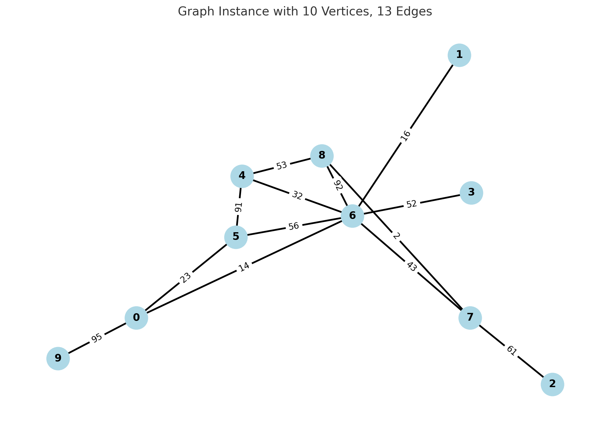

# Edge-Weighted Balanced Connected Partitions

This repository contains the code accompanying the research paper:

**Morteza Davari, Phablo F. S. Moura, and Hande Yaman**  
*Edge-Weighted Balanced Connected Partitions: Hardness and Formulations*, 2025.  
[arXiv:2504.02421](https://arxiv.org/abs/2504.02421)

> 📌 **Note:** This version of the repository corresponds to the codebase used for the initial submission of the paper.

## Overview

This code provides implementations of various exact algorithms and mathematical formulations for the **Edge-Weighted Balanced Connected Partition** problem. The objective is to partition a graph into connected components that are balanced (e.g., in size or weight) while minimizing the total cost of cut edges.

## Directory Structure

- **`TIF/`**  
  Contains the full implementation of all methods described in the paper, including different formulations and algorithms.

- **`HeaviestBalancedTree/`**  
  Includes the code used for generating test instances.

- **`Computational Results/`**  
  Contains output data, tables, and performance results from running the algorithms on benchmark instances.

- **`Instances/`**  
  Provides the graph instances used in the experiments, including input files for testing various scenarios.

## Compilation

The codebase was developed using **Visual Studio C++ 2025**. For Linux-based systems, you can compile the code using **CMake**. Ensure that the following libraries are installed and properly linked:

- [Boost](https://www.boost.org/)
- [LEMON](https://lemon.cs.elte.hu/trac/lemon)
- [IBM ILOG CPLEX](https://www.ibm.com/products/ilog-cplex-optimization-studio)
- [SFML](https://www.sfml-dev.org/) (Simple and Fast Multimedia Library) — if needed for visualization or I/O

> ⚠️ Make sure CPLEX is licensed and properly set up in your environment.

## 📂 Instances Directory

The `Instances/` directory contains benchmark graphs used to evaluate the performance of our algorithms. Each instance defines an undirected edge-weighted graph and the number of desired partitions (connected components/trees).

### 🔖 File Format

Each instance file is a plain text file with the following structure:

- `n` – Number of vertices (vertices are labeled from `0` to `n−1`)
- `m` – Number of undirected edges
- `k` – Number of connected partitions (trees) into which the graph should be divided
- Each line that follows contains:
  - `uᵢ` and `vᵢ` – Endpoints of the edge
  - `wᵢ` – Non-negative weight of the edge

### 📘 Example
```txt
10	13	2
3	 6 	 52
4	 5 	 91
0	 6 	 14
4	 6 	 32
8	 4 	 53
7	 8 	 2
5	 0 	 23
0	 9 	 95
2	 7 	 61
6	 1 	 16
6	 5 	 56
6	 8 	 92
7	 6 	 43
```



## Citation

If you use this code in your research, please cite the paper as follows:

```bibtex
@misc{davari2025edgeweightedbalancedconnectedpartitions,
  title        = {Edge-Weighted Balanced Connected Partitions: Hardness and Formulations},
  author       = {Morteza Davari and Phablo F. S. Moura and Hande Yaman},
  year         = {2025},
  eprint       = {2504.02421},
  archivePrefix = {arXiv},
  primaryClass = {cs.DS}
}
